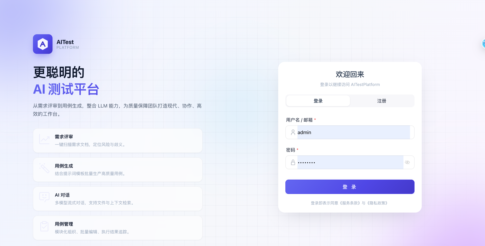
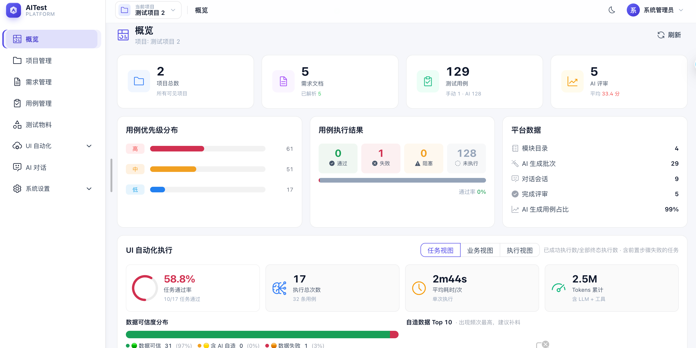
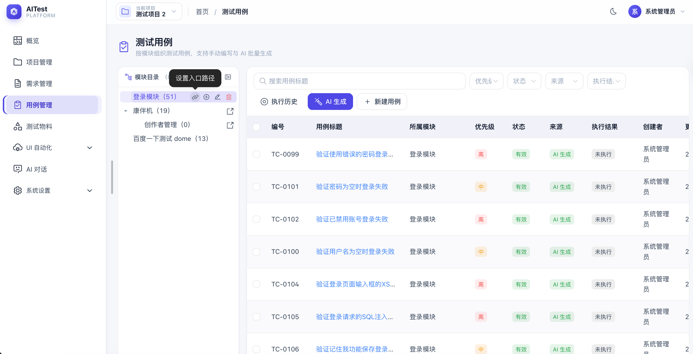
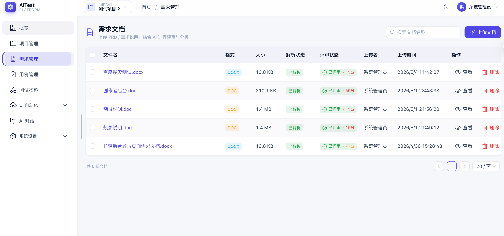
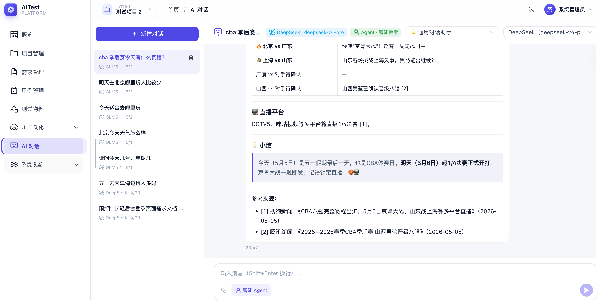
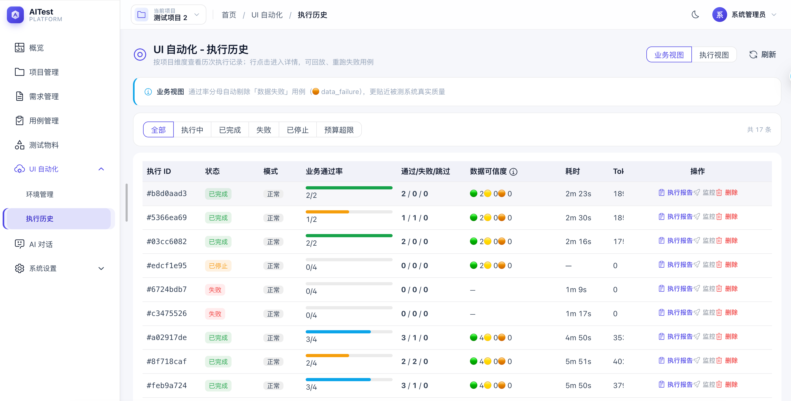
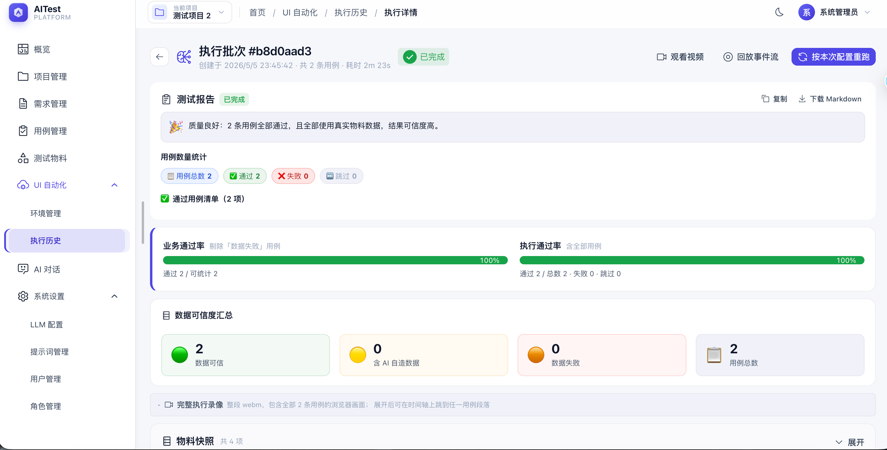
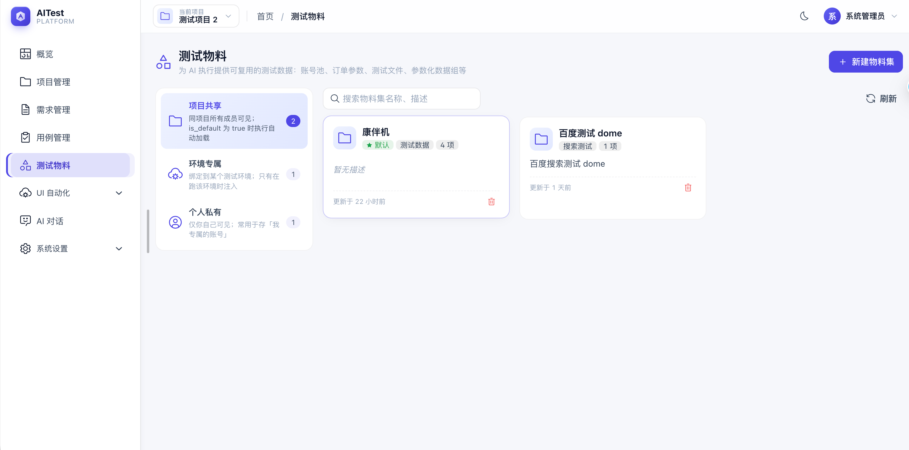
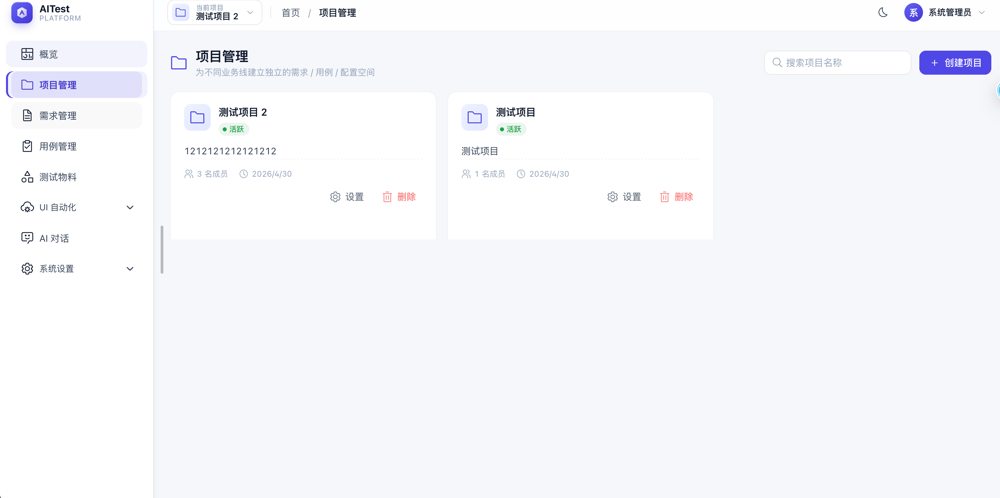
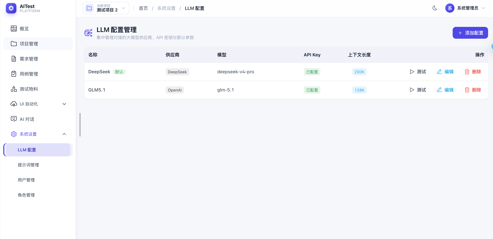

# AITestPlatform

<div align="center">

### 🤖 AI 驱动的轻量测试管理平台

**让 AI 做重活，让人做决策。**

一站式覆盖 **需求评审 → 用例生成 → UI 自动化执行 → 报告分析** 的全链路；
内置 LLM tool-calling 循环 + Playwright MCP，用自然语言描述用例、AI 自驱浏览器跑通业务，
全程录屏 / 快照 / tool_call 可回放。

[](https://www.python.org/)
[](https://fastapi.tiangolo.com/)
[](https://vuejs.org/)
[](https://www.typescriptlang.org/)
[](https://playwright.dev/)
[](https://www.postgresql.org/)
[](https://www.docker.com/)
[](LICENSE)

[快速开始](#-快速开始) · [部署方式](#-部署方式) · [使用指南](#-ui-自动化使用指南) · [排错](#-排错速查) · [文档](#-进一步阅读) · [路线图](#%EF%B8%8F-路线图)

</div>

---

## 📖 项目介绍

AITestPlatform 是一款**AI 驱动的轻量级测试管理平台**，目标是把测试团队最耗时的"读需求 → 写用例 → 跑回归 → 看报告"四个环节交给 AI 做，让人专注在**需求理解 / 边界覆盖 / 失败诊断**这些真正需要判断力的地方。

技术上采用：

- **后端** FastAPI + SQLAlchemy 2.0 + PostgreSQL，原生异步、SSE 友好
- **前端** Vue 3.5 + TypeScript + Naive UI + UnoCSS，类型安全 + 极简设计
- **AI 层** OpenAI SDK 兼容协议（DeepSeek / 通义 / Ollama / GPT 等），LLM tool-calling 循环
- **浏览器自动化** Playwright + `@playwright/mcp`（微软官方 MCP），AI 直接驱动 chromium
- **容器化** Docker Compose 三容器最小架构（db / backend / frontend）

与同类平台的差异化优势：

| 差异点 | 说明 |
|---|---|
| 🔌 **AI 用 MCP 操作浏览器** | 不写 selector，靠语义定位元素，对页面 DOM 重构强健 |
| 🧪 **三层数据可信度** | 区分"功能问题"和"测试数据问题"，业务通过率自动剔除数据噪音 |
| 🖥️ **服务器也能"看见"AI 的浏览器** | 内置 Xvfb + x11vnc + noVNC，远程实时观察 chromium 操作 |
| 🌐 **VPN / 内网场景一键解** | 双路代理（http_login + chromium 出口分别可控），mac/win/linux 三平台都覆盖 |
| 🛠️ **运维深度** | 25 条排错速查、清理 cron、token 预算守卫、错误回放、镜像瘦身计划全套 |

---

## 🎯 核心特性

### 一期：测试管理 + AI 助手

| 模块 | 能力 | 优势 |
|---|---|---|
| 📄 **需求文档管理** | Word / PDF / Markdown 上传，AI 自动评审、抽取关键点、给改进建议 | 替代手工通读全文 |
| 📝 **测试用例管理** | 模块树组织、增删改查、Excel 导入导出 | 与项目 / 模块解耦的多对多结构 |
| 🤖 **AI 用例批量生成** | 基于需求文档 + 系统提示词流式生成；支持中断 / 续接 | 一次生成数十条用例，token 预算自动控制 |
| 💬 **AI 智能对话** | 流式 SSE，自动识别"评审" / "生成"意图并触发后台任务；多会话、文件附件 | 用户用自然语言完成几乎所有操作 |
| 🧠 **多 LLM 支持** | OpenAI 协议兼容（DeepSeek / 通义 / Ollama / GPT 等）；平台内多 Provider 配置切换 | 不绑定单一供应商 |
| 📋 **提示词管理** | 系统模板 + 自定义模板；按分类自动注入对话；版本号 + 历史回滚 | 提示词变更可追溯 |
| 👥 **项目 / 角色 / 用户** | 多项目隔离；RBAC 角色（admin / member / viewer）；项目成员 + 全局权限矩阵 | 简单清晰，覆盖小团队所有场景 |
| 📊 **数据仪表盘** | 项目进度、用例覆盖、AI 活动、UI 自动化双视图通过率（业务/执行/任务） | 单页一览所有运营指标 |

### 二期：UI 自动化

| 模块 | 能力 | 优势 |
|---|---|---|
| 🎯 **执行环境** | URL / 浏览器配置 / 前置步骤模板（http_login / ai_login / state_inject）；登录态 storage_state 自动复用 | 一次配置，N 次复用 |
| 📦 **测试物料体系** | 6 种类型（string / secret / multiline / file / random / dataset）× 5 级层级（项目默认 / 环境 / 用例 / 个人 / 一次性覆盖） | 解决"用例只描述做什么、缺少具体数据"的真实痛点 |
| 🤖 **AI 自驱执行** | LLM tool-calling 循环 + Playwright MCP；每步 accessibility 快照 + diff 增量；token 预算守卫 | 非 selector，靠语义定位元素，对页面 DOM 重构强健 |
| ✅ **三层数据可信度** | reliable（真实物料）/ synthesized（AI 自造）/ data_failure；业务通过率自动排除"数据问题导致的失败" | 区分"功能问题"与"测试数据问题" |
| 🔄 **批量执行 + 用例间状态隔离** | 批量任务在每条用例之间执行 `reset_for_next_case`：关闭多余 page、回到 `about:blank`、保留登录态 | 避免上一条用例的弹窗 / 表单状态污染下一条 |
| 🎬 **执行可观察性** | SSE 实时事件流；每步 snapshot before/after + tool_call 时间线；视频 + trace + 截图 | 失败现场可完整回放 |
| 🖥️ **实时画面（noVNC）** | 容器内 Xvfb + x11vnc + websockify，前端 iframe 直接看 chromium 实时画面 | 服务器部署也能"看见"AI 的浏览器操作 |
| 🌐 **内网 VPN 兼容** | 双路代理（http_login 专用 + chromium 出口分别可控）；docker-compose.vpn.yml 一键开启 | 被测系统在公司内网时仍可用 |
| 🧹 **自动清理 cron** | 视频 / 截图 / trace / storage_state / 物料 file 按保留天数自动回收 | 长期运行不爆盘 |

> **🚧 三期路线**：把一二期的"AI 主动操作"统一抽象为 Skill 体系（与 OpenClaw 协议对齐），支持自定义 skill 上传、触发词召回、Agent 自主调用。

---

## 🏗️ 系统架构

### 容器拓扑

```
┌────────── User Browser ──────────┐
│ http://host           ws /novnc/ │
└─────────────┬────────────────────┘
              │
          (port 80)
              │
   ┌──────────┴──────────┐
   │  frontend (nginx)   │   ← 静态 SPA + /api/ 反代 + /novnc/ ws 反代
   │  Vue 3 + Naive UI   │
   └────────┬────────────┘
            │ /api/         /novnc/
       (port 8000)     (backend:6080)
            │
   ┌────────┴───────────────────────────────────┐
   │  backend (FastAPI / uvicorn 单 worker)      │
   │ ┌──────────────────────────────────────┐   │
   │ │  业务模块（auth/projects/llm/...)     │   │
   │ │  ChatStreamHub + ExecutionStreamHub  │   │
   │ │  ─────────────────────────────────   │   │
   │ │  Playwright MCP (Node 子进程)         │   │
   │ │  Chromium (有头 → Xvfb :99)           │   │
   │ │  Xvfb + x11vnc + websockify (:6080)  │   │
   │ │  Cleanup cron (asyncio task)         │   │
   │ └──────────────────────────────────────┘   │
   └────────┬───────────────────────────────────┘
            │
       (port 5432)
            │
   ┌────────┴─────────────┐
   │  PostgreSQL 16       │
   │  (named volume pgdata)│
   └──────────────────────┘
```

### 关键数据卷

| Volume | 容器路径 | 用途 | 是否被 nginx 暴露 |
|---|---|---|---|
| `pgdata` | DB 数据目录 | PostgreSQL 持久化 | 否 |
| `backend_uploads` | `/app/uploads` | 一期需求文档、向后兼容根挂载 | 否 |
| `test_data` | `/app/uploads/test-data` | 物料 file 类型的物理文件 | 否（走后端 reveal API） |
| `ui_artifacts` | `/app/uploads/ui_artifacts` | 视频 / trace / 截图 | 是（`/uploads/ui_artifacts/` 只读） |
| `ui_state` | `/app/uploads/ui_state` | BrowserContext storage_state（含登录 cookie） | 否（容器内 chmod 700） |

> 子挂载顺序很重要：父挂载（`backend_uploads`）在前，子挂载（`test_data` / `ui_artifacts` / `ui_state`）在后。Docker 会让子挂载覆盖父挂载里同路径的目录，**反过来则父挂载会把子挂载吞掉**。

### 端口

| 端口 | 服务 | 是否对外暴露 | 配置项 |
|---|---|---|---|
| 80 → host:`${FRONTEND_PORT}` | frontend nginx | 是（用户访问入口） | `.env` 里 `FRONTEND_PORT=8080` 改宿主端口（容器内固定 80） |
| 8000 → host:`${BACKEND_PORT}` | backend uvicorn | 是（开发 / 直接调 API 用） | `.env` 里 `BACKEND_PORT=7008` 改宿主端口（容器内固定 8000） |
| 5432 → host:`${POSTGRES_PORT}` | PostgreSQL | 默认暴露（生产可关，仅留容器网络） | `.env` 里 `POSTGRES_PORT` |
| 6080 | websockify (noVNC) | **否**（仅容器网络，前端经 `/novnc/` 反代） | — |
| 5173 | vite dev server | 仅本地开发 | — |

#### 浏览器访问规则

| 部署场景 | `.env` 配置 | 浏览器访问地址 |
|---|---|---|
| 默认（80 空闲） | `FRONTEND_PORT=80`（或不写） | `http://localhost` 或 `http://your-server-ip` —— **不用带端口** |
| 80 已被占用 | `FRONTEND_PORT=8080` | `http://your-server-ip:8080` —— **必须带端口** |
| 上游有 Caddy/Nginx + HTTPS | `FRONTEND_PORT=8080`（任意，不直接暴露用户）| `https://your-domain.com`（由上游反代到容器 8080） |

> **为什么默认不带端口？** HTTP 默认走 80 端口，浏览器自动补全；只有改成非 80 端口（如 8080）才需要在 URL 里显式写 `:8080`。
> HTTPS 同理：默认走 443 端口，URL 里也不需要写 `:443`。

#### 端口冲突时怎么改？

后端 / 前端宿主端口都是可配置的，**容器内部端口固定不变**（前端 nginx 通过 docker 内部网络反代 `backend:8000`，不受宿主端口影响）：

```bash
# 服务器上 80 / 8000 都被其它项目占用
echo "FRONTEND_PORT=7080" >> .env
echo "BACKEND_PORT=7008"  >> .env
docker compose up -d              # 重建受影响的容器即可，无需改任何代码
```

- 浏览器访问入口：`http://your-server-ip:7080`
- 后端 API（直接调试）：`http://your-server-ip:7008`

---

## 🛠️ 技术栈

| 层 | 选型 | 关键考量 |
|---|---|---|
| **后端框架** | FastAPI 0.115+ | 原生异步、自动 OpenAPI、SSE 友好 |
| **ORM** | SQLAlchemy 2.0（async） + Alembic | 类型驱动、迁移可控 |
| **数据库** | PostgreSQL 16 | 成熟、JSONB / 全文检索、唯一外键 / 约束完整 |
| **认证** | JWT（python-jose）+ bcrypt | 无状态、可平移 |
| **加密** | Fernet（cryptography） | 密码 / API key / 物料 secret 列加密 |
| **AI 调用** | OpenAI SDK 2.x | 通用协议，可对接 DeepSeek / 通义 / Ollama 等 |
| **浏览器自动化** | Playwright 1.59+ + `@playwright/mcp` | LLM tool-calling 直接驱动 chromium |
| **OCR（验证码）** | ddddocr | 全离线、无外网依赖 |
| **文档解析** | python-docx / pypdf / antiword / catdoc | Word / PDF / 旧 .doc 全覆盖 |
| **远程画面** | Xvfb + x11vnc + websockify + noVNC | 容器内有头浏览器实时投屏 |
| **前端框架** | Vue 3.5 + TypeScript 5.6 + Vite 6 | 性能 + 类型安全 |
| **UI 组件库** | Naive UI 2.40 | 轻量、TS 原生、主题灵活 |
| **CSS** | UnoCSS + 设计 tokens 自定义 | 按需生成、无运行时 |
| **状态管理** | Pinia | Vue 官方推荐 |
| **HTTP 客户端** | ofetch | 体积小、原生 SSE |
| **包管理** | uv（后端）+ pnpm（前端） | 极速、严格 lockfile |
| **容器化** | Docker Compose | 三容器最小架构 |
| **CI / CD** | GitHub Actions + GHCR | 镜像自动构建推送（详见 [`docs/DEPLOYMENT_GHCR.md`](docs/DEPLOYMENT_GHCR.md)） |
| **进程模型** | uvicorn 单 worker | 内存内 ChatStreamHub / ExecutionStreamHub 不可跨进程；扩容需先迁移到 Redis pub/sub 或 PG LISTEN/NOTIFY |

---

## 📂 项目结构

```
AITestPlatform/
├── docker-compose.yml          # 生产部署编排（默认）
├── docker-compose.dev.yml      # 开发数据库（仅 db）
├── docker-compose.vpn.yml      # VPN 场景 override（详见 §部署方式 D-1）
├── docker-compose.prod.yml     # GHCR 镜像拉取部署（详见 docs/DEPLOYMENT_GHCR.md）
├── run.sh                      # 主命令入口（dev / up / down / install / db-* / test / lint / format ...）
├── Makefile                    # run.sh 的子集（兼容传统 make 用户）
├── scripts/
│   ├── init.sh                 # 一键初始化（首次部署推荐）
│   └── release.sh              # 打 tag + 推送 GHCR 触发 CI
├── .env.example                # 环境变量模板
├── .github/workflows/          # GitHub Actions：build-and-push.yml
├── docs/                       # 设计文档
│   ├── NEW_PLATFORM_DESIGN.md  # 一期总体设计
│   ├── IMPLEMENTATION_PLAN.md  # 一期实施计划
│   ├── PHASE2_DESIGN.md        # 二期 UI 自动化设计
│   ├── PHASE2_IMPLEMENTATION_PLAN.md
│   ├── PHASE3_DESIGN.md        # 三期 Skill 体系设计（路线图）
│   ├── PHASE3_IMPLEMENTATION_PLAN.md
│   ├── PROMPT_MANAGEMENT_DESIGN.md
│   ├── DEPLOYMENT_GHCR.md      # GHCR 拉取镜像部署完整教程
│   └── IMAGE_SLIMMING_PLAN.md  # 镜像瘦身计划（基线 / 路线 / 验证矩阵）
├── backend/                    # FastAPI 后端
│   ├── Dockerfile              # 含 Node + Chromium + Xvfb + noVNC
│   ├── entrypoint.sh           # 启动 Xvfb / x11vnc / websockify / 等待 DB / 迁移 / 建管理员
│   ├── pyproject.toml / uv.lock
│   ├── alembic.ini / alembic/  # 数据库迁移
│   └── app/
│       ├── main.py             # FastAPI 装载所有 router
│       ├── config.py           # Settings（Pydantic）
│       ├── database.py         # async session
│       ├── core/               # 通用：security / crypto / deps / exceptions
│       └── modules/
│           ├── auth/           # 登录、JWT、角色
│           ├── users/          # 用户 CRUD
│           ├── projects/       # 项目 + 成员 + 角色绑定
│           ├── requirements/   # 需求文档上传 / 解析 / 评审
│           ├── llm/            # LLM Provider 配置 + 对话 + 意图识别
│           ├── prompts/        # 提示词模板（系统/自定义/版本）
│           ├── testcases/      # 用例 + 模块树 + AI 生成
│           ├── dashboard/      # 项目维度统计（含 UI 双视图通过率）
│           ├── ui_automation/  # 二期：执行引擎 / 环境 / cleanup cron
│           ├── test_data/      # 二期：物料管理（6 种类型 × 5 级层级）
│           └── admin/          # 二期：超管 API（手动触发清理等）
└── frontend/                   # Vue 3 SPA
    ├── Dockerfile              # multi-stage：node 构建 → nginx 部署
    ├── nginx.conf              # SPA + /api/ 反代 + /novnc/ 反代 + 静态缓存
    ├── package.json / pnpm-lock.yaml
    └── src/
        ├── views/              # 页面（按业务域分组）
        ├── components/         # 组件
        ├── stores/             # Pinia
        ├── services/           # API 客户端
        ├── composables/        # useChat / useExecutionSSE / usePermission
        ├── router/             # 路由 + 守卫
        └── theme/              # NaiveUI 主题覆盖
```

---

## 🎨 界面展示

> 📸 **截图陆续补充中**。如果你已经在使用本项目，欢迎 PR 截图到 `docs/screenshots/` 目录帮助新用户快速了解产品。

期望补齐的截图清单：

- 登录页（`/login`）

- 数据仪表盘（项目维度统计 / 双视图通过率）

- 测试用例管理（模块树 + AI 生成）

- 需求管理（文档上传 + AI 评审）

- AI 智能对话（流式 SSE）

- UI 自动化执行监控（SSE 时间线 + 实时画面 noVNC）

- 执行报告详情（视频 / trace / 截图回放）

- 测试物料管理（6 种类型 × 5 级层级）

- 项目管理

- LLM Provider 配置


---

## 🚀 快速开始

### 在线体验

> 🌐 http://49.232.246.119:7080/login
>    ps:admin/admin123

### 环境要求

| 部署方式 | 必需 | 推荐版本 |
|---|---|---|
| **本地开发** | Docker（仅 DB） + Python 3.11 + Node 18+ + uv + pnpm | Docker Desktop 最新；Python 3.11；Node 20 LTS |
| **Docker 本地部署** | Docker 20.10+ + Compose v2 | Docker Desktop 4.30+ |
| **Linux 服务器部署** | Docker 20.10+ + Compose v2 | Ubuntu 22.04 / Debian 12 / RHEL 9 |
| **GHCR 拉取部署** | Docker 20.10+ + Compose v2 + 公网（或 GHCR mirror） | 见 [`docs/DEPLOYMENT_GHCR.md`](docs/DEPLOYMENT_GHCR.md) |
| **VPN 场景（D-1）** | 上面任一 + 宿主机已连接公司 VPN + 一个 HTTP 代理工具（pproxy / mitmproxy / tinyproxy 任一） | — |
| **VPN 场景（D-2）** | Linux 主机 + WireGuard 或 OpenVPN 配置文件 | Ubuntu 22.04+ |

最低硬件：

- CPU：2 核
- 内存：4 GB（Chromium + Node MCP 子进程吃 1-1.5 GB）
- 磁盘：10 GB（基础镜像 ~4 GB；视频 / trace 按 `UI_MEDIA_RETENTION_DAYS` 滚动）

### 路径 A：本地体验（5 分钟）

```bash
# 1. 克隆代码
git clone <repo-url> && cd AITestPlatform

# 2. 一键初始化（自动 .env / build / up / 健康检查；首次约 10 分钟含 Chromium）
bash scripts/init.sh

# 3. 浏览器访问
# 前端：http://localhost                     ← 默认 80 端口，URL 里不需要写
# 若 .env 改了 FRONTEND_PORT=8080：http://localhost:8080
# 后端 Swagger：http://localhost:8000/docs    ← DEBUG=true 时

# 4. 登录默认账号
# 用户名：admin
# 密码：admin123 （首次登录后立即修改！）

# 5. 配一个 LLM Provider
# 进入「系统设置 → LLM 配置」，新增一个 OpenAI 协议兼容的 Provider
# （DeepSeek / 通义 / Ollama / GPT 等任选）即可开始使用 AI 功能
```

### 路径 B：服务器生产部署（3-5 分钟，⭐ 推荐）

不用 git clone 整个仓库，不用本地 build，直接拉 GitHub Actions 预构建好的镜像：

```bash
# 1. 服务器上准备目录 + 下载部署文件（不是整个仓库！）
mkdir -p ~/aitestplatform && cd ~/aitestplatform
curl -fsSL -o docker-compose.prod.yml \
  https://raw.githubusercontent.com/<your-username>/AITestPlatform/main/docker-compose.prod.yml
curl -fsSL -o .env.example \
  https://raw.githubusercontent.com/<your-username>/AITestPlatform/main/.env.example
cp .env.example .env

# 2. 编辑 .env：填 GHCR_OWNER / SECRET_KEY / ENCRYPT_KEY / ADMIN_PASSWORD / POSTGRES_PASSWORD
nano .env

# 3. 拉镜像 + 启动
docker compose -f docker-compose.prod.yml --env-file .env pull
docker compose -f docker-compose.prod.yml --env-file .env up -d

# 4. 验证 + 浏览器访问
curl http://localhost/api/health
# 期望：{"status":"ok"}
```

完整 10 步详细教程（含装 Docker、生成密钥、防火墙开端口、HTTPS 反代、开机自启、升级、回滚、首次部署常见坑）：→ [§方案 E：GHCR 拉取预构建镜像](#方案-eghcr-拉取预构建镜像最快3-5-分钟部署--生产首次部署推荐)

### 想看其它部署方式？

→ [📦 部署方式](#-部署方式)（共 5 种方案：本地开发 / Docker 本地 / 服务器自 build / VPN 内网 / GHCR 拉取）

---

## 📦 部署方式

提供五种部署模式，覆盖从本地开发到生产环境的所有场景：

| 方案 | 适用场景 | 启动方式 | 首次耗时 |
|---|---|---|---|
| **A** | 本地开发联调（前后端热更新） | `./run.sh dev` | 5 分钟 |
| **B** | 本地或测试环境 Docker 一键 | `bash scripts/init.sh` | 10-15 分钟（含本地 build） |
| **C** | Linux 服务器自己 build 部署 | 同 B + 生产化清单 | 10-15 分钟 |
| **D** | 被测系统在公司内网 / 需 VPN | D-1 宿主机代理 / D-2 容器内 VPN | 同 B/C |
| **⭐ E** | **生产服务器首选**：拉 GHCR 预构建镜像，无需本地 build | 见 [§方案 E](#方案-eghcr-拉取预构建镜像最快3-5-分钟部署--生产首次部署推荐) | **3-5 分钟** |

> 💡 **第一次在服务器上部署？** 强烈推荐**方案 E**：跳过本地 build（节省 10 分钟），直接拉 GitHub Actions 预构建好的镜像，几行命令搞定。

### 方案 A：本地开发（前后端热更新）

适合本地开发联调。数据库在容器里，前后端跑在宿主机。

```bash
# 1. 安装工具链
brew install uv node pnpm                # macOS
# Linux: curl -LsSf https://astral.sh/uv/install.sh | sh && nvm install 20 && npm i -g pnpm

# 2. 克隆 + 准备 env
git clone <repo-url> && cd AITestPlatform
cp .env.example .env

# 3. 安装依赖（首次执行）
./run.sh install
# 等价：cd backend && uv sync && cd ../frontend && pnpm install

# 4. 一键启动开发环境
./run.sh dev
# 自动完成：
#   - docker compose -f docker-compose.dev.yml up -d db   # 仅起 PostgreSQL
#   - 后端：uv run uvicorn app.main:app --reload  → :8000
#   - 前端：pnpm dev                              → :5173
```

访问：

| 服务 | 地址 |
|---|---|
| 前端（热更新） | http://localhost:5173 |
| 后端 API + Swagger | http://localhost:8000/docs |

> 默认管理员：`admin / admin123`，由 `backend/entrypoint.sh` 在容器**首次**启动时通过 inline Python 脚本创建（DB 中已存在 admin 时跳过）。本地开发模式下后端跑在宿主机、不走 entrypoint，**所以本地首次启动需要先建表 + 建管理员**：
>
> ```bash
> cd backend
>
> # 1. 建表（应用全部 alembic 迁移）
> uv run alembic upgrade head
>
> # 2. 建系统角色 + 默认 admin 用户
> #    复用 entrypoint.sh 里的同一段 Python；只在 admin 不存在时才插入
> uv run python -c "
> import asyncio, os
> from sqlalchemy import select, or_, insert
> from app.database import async_session_factory
> from app.modules.auth.models import User, Role, user_roles
> from app.modules.auth.init_data import init_roles
> from app.core.security import hash_password
>
> async def main():
>     await init_roles()
>     async with async_session_factory() as db:
>         exists = (await db.execute(
>             select(User).where(or_(User.username == 'admin', User.email == 'admin@aitest.local'))
>         )).scalar_one_or_none()
>         if exists:
>             print('admin already exists'); return
>         u = User(username='admin', email='admin@aitest.local',
>                  hashed_password=hash_password('admin123'),
>                  display_name='系统管理员', is_superuser=True, is_active=True)
>         db.add(u); await db.flush()
>         ar = (await db.execute(select(Role).where(Role.name == 'admin'))).scalar_one_or_none()
>         if ar:
>             await db.execute(insert(user_roles).values(user_id=u.id, role_id=ar.id))
>         await db.commit()
>         print('admin created: admin / admin123')
>
> asyncio.run(main())
> "
> ```
>
> 注意：`docker-compose.dev.yml`（开发用）与 `docker-compose.yml`（生产用）使用**不同的 PG named volume**（`pgdata_dev` vs `pgdata`），数据**不互通**。所以方案 A 模式下永远是从 `pgdata_dev` 起步的，第一次必须手动跑上面的两步。

数据库管理：

```bash
./run.sh db-migrate "add foo column"  # 生成迁移
./run.sh db-upgrade                    # 应用迁移
./run.sh db-reset                      # 重置（开发用，会清数据！）
```

### 方案 B：Docker 本地一键部署（推荐）

最常用方式。三个容器（db / backend / frontend），一行命令启动。

#### B-1：自动化（推荐首次部署）

```bash
git clone <repo-url> && cd AITestPlatform

bash scripts/init.sh
# 脚本会自动完成：
#   1. 检查 docker / docker compose 可用
#   2. 从 .env.example 复制 .env，并生成随机 SECRET_KEY
#   3. docker compose build         （首次约 5–10 分钟，含 Chromium）
#   4. docker compose up -d
#   5. 健康检查 /api/health 直到就绪
```

完成后：

| 服务 | 地址 |
|---|---|
| 前端 | http://localhost（端口默认 80，由 `.env` 的 `FRONTEND_PORT` 控制；80 是 HTTP 默认端口，URL 不需要写） |
| 后端 Swagger | http://localhost:8000/docs（端口默认 8000，由 `.env` 的 `BACKEND_PORT` 控制） |

默认管理员：`admin / admin123`，**首次登录后立即修改！**

> **服务器上 80 / 8000 被其它项目占用？** 在 `.env` 里加：
> ```bash
> FRONTEND_PORT=8080      # 浏览器访问端口（改了之后访问要带端口）
> BACKEND_PORT=7008       # API 端口
> ```
> 然后 `docker compose up -d` 重建即可。容器内 nginx / uvicorn 仍是 80 / 8000，
> 前端反代不受宿主端口影响（详见上文 [端口](#端口) 章节）。

#### B-2：手动逐步（看清楚每一步）

```bash
git clone <repo-url> && cd AITestPlatform

# 1. 准备 .env
cp .env.example .env
# 修改：SECRET_KEY / POSTGRES_PASSWORD / ADMIN_PASSWORD

# 2. （可选）生成 ENCRYPT_KEY；不设置则用 config.py 的开发默认值
python -c "from cryptography.fernet import Fernet; print('ENCRYPT_KEY=' + Fernet.generate_key().decode())" >> .env

# 3. 构建镜像
docker compose build

# 4. 启动
docker compose up -d

# 5. 看日志确认 backend 就绪
docker compose logs -f backend
# 看到 "Uvicorn running on http://0.0.0.0:8000" 即可（这是容器内端口，不变）

# 6. 健康检查（宿主机端口默认 8000；若 .env 里改了 BACKEND_PORT 就用新端口）
curl http://localhost:${BACKEND_PORT:-8000}/api/health
# {"status":"ok","service":"AITestPlatform"}
```

#### B-3：升级与重启

```bash
git pull
docker compose build                  # 重新构建
docker compose up -d                  # 增量重启（仅变化的服务）

# 仅重建 frontend（改 nginx.conf / Vue 代码常用）
docker compose up -d --build frontend

# 仅重建 backend（改 Python 代码常用）
docker compose up -d --build backend
```

> **关键坑**：`docker compose up -d --build frontend` 也会顺便 recreate 它依赖的 backend 容器（`depends_on`）。如果你刚刚通过 vpn override 启动过 backend，这次普通命令会把 vpn override 的环境变量清空。带 override 时**每次都要带全文件参数**：
> ```bash
> docker compose -f docker-compose.yml -f docker-compose.vpn.yml up -d backend
> ```

### 方案 C：Linux 服务器部署

与方案 B 几乎相同，但有几个生产化要点。

#### 生产化清单

```bash
# 1. 安装 Docker（Ubuntu / Debian）
curl -fsSL https://get.docker.com | sh
sudo usermod -aG docker $USER && newgrp docker

# 2. 拷贝项目
scp -r AITestPlatform user@server:/opt/
ssh user@server
cd /opt/AITestPlatform

# 3. 准备生产 .env（强密码、关 DEBUG）
cp .env.example .env
vi .env
# 必改：
#   SECRET_KEY=$(openssl rand -base64 48)
#   ENCRYPT_KEY=$(python3 -c "from cryptography.fernet import Fernet; print(Fernet.generate_key().decode())")
#   POSTGRES_PASSWORD=<强密码>
#   ADMIN_PASSWORD=<强密码>
#   DEBUG=false

# 4. 启动
docker compose up -d --build

# 5. （可选）反向代理：在 nginx 前再套一层 Caddy / Traefik 加 HTTPS
```

#### 关闭对外 5432 端口（生产建议）

`docker-compose.yml` 默认把 PostgreSQL 5432 暴露到宿主机，方便本地连数据库排查。生产环境建议关掉：

```yaml
# docker-compose.yml
services:
  db:
    ports: []         # ← 注释或删除原 5432 行；不写 ports 即不对外
```

backend 容器仍可经容器网络访问 `db:5432`，无影响。

#### 系统服务化（开机自启）

`docker compose up -d` 加 `restart: unless-stopped` 已能自动重启。如要更严格的开机启动，写一份 systemd unit：

```ini
# /etc/systemd/system/aitest.service
[Unit]
Description=AITestPlatform
Requires=docker.service
After=docker.service

[Service]
Type=oneshot
RemainAfterExit=yes
WorkingDirectory=/opt/AITestPlatform
ExecStart=/usr/bin/docker compose up -d
ExecStop=/usr/bin/docker compose down

[Install]
WantedBy=multi-user.target
```

```bash
sudo systemctl daemon-reload && sudo systemctl enable --now aitest
```

#### 资源约束

如服务器同时跑别的服务，给 backend 容器加资源上限（chromium 偶发吃内存）：

```yaml
# docker-compose.override.yml（与 docker-compose.yml 自动叠加）
services:
  backend:
    deploy:
      resources:
        limits:
          cpus: "2.0"
          memory: 3G
```

### 方案 D：被测系统在公司内网（VPN 场景）

> **现象**：宿主机 `curl https://你的内网/login` HTTP=200，但 `docker exec backend curl ...` 直接 ConnectTimeout。
>
> **根因**：被测域名解析到 RFC1918 内网地址（如 `172.17.x.x`），而 macOS Docker Desktop / Windows WSL 的容器跑在独立的 Linux VM 里，**这个 VM 不共享宿主的 VPN 路由表**。Linux 原生 Docker 在 `network_mode: host` 下没这个问题。

提供两种解法：D-1 让容器借宿主机 VPN（最常用），D-2 让容器自己建 VPN（最干净）。

#### D-1：宿主机代理模式（macOS / Windows Docker Desktop）

让容器把所有"访问内网"的流量经一个**跑在宿主机上的 HTTP 代理**出去；该代理进程持有宿主机的 VPN 路由，自然能命中内网。

```
┌─ container ─┐    ┌─── macOS host ───┐     ┌─ 公司 VPN ─┐
│ chromium    │───>│ pproxy:8118      │────>│ utun ...   │───> 内网
│ httpx       │    │ (持有 utun 路由) │     └────────────┘
└─────────────┘    └──────────────────┘
   通过 host.docker.internal:8118
```

**步骤一：在宿主机起一个 HTTP 代理（任选其一）**

```bash
# 方案 1：pproxy（一行 pip，零配置，推荐）
pip install pproxy
pproxy -l http://0.0.0.0:8118 &

# 方案 2：mitmproxy（功能多，能抓包）
pip install mitmproxy
mitmdump --listen-host 0.0.0.0 --listen-port 8118 &

# 方案 3：tinyproxy（brew 装，配置简单）
brew install tinyproxy
cat >/tmp/tinyproxy.conf <<EOF
Listen 0.0.0.0
Port 8118
Allow 127.0.0.1
Allow 192.168.65.0/24
EOF
tinyproxy -c /tmp/tinyproxy.conf
```

**步骤二：宿主机自验证（一定要做）**

```bash
curl --proxy http://localhost:8118 -sSI https://你的内网域名/api/health
# 必须返回 200；否则代理本身就不通，下面没意义
```

**步骤三：启动 backend 时叠加 vpn override**

```bash
docker compose -f docker-compose.yml -f docker-compose.vpn.yml up -d backend
```

`docker-compose.vpn.yml` 自动注入：

```yaml
UI_HTTP_LOGIN_PROXY=http://host.docker.internal:8118    # backend 走 http_login 时的专用代理
UI_BROWSER_PROXY=http://host.docker.internal:8118       # chromium 启动时透传给 --proxy-server
HTTP_PROXY=http://host.docker.internal:8118             # backend 其它出口（含 LLM）也走这条
HTTPS_PROXY=http://host.docker.internal:8118
NO_PROXY=localhost,127.0.0.1,host.docker.internal,db,backend,frontend
```

> **关键坑 1**：`UI_HTTP_LOGIN_PROXY` 是必填项，不能只设 `HTTP_PROXY` —— backend 的 http_login 模块用 `httpx(trust_env=False)` 主动忽略 `HTTP_PROXY`（避免污染 LLM 调用），必须显式声明。
>
> **关键坑 2**：`UI_BROWSER_PROXY_BYPASS` 必须包含 `localhost,127.0.0.1,host.docker.internal,db,backend,frontend`，否则 chromium 经代理回访自身 / 数据库时会断。
>
> **关键坑 3**：split-tunnel VPN（公网不走 VPN）下，`HTTP_PROXY=` / `HTTPS_PROXY=` 这两行可能让 LLM 调用变慢甚至失败 —— 因为 LLM 在公网，反而被代理回旋。这种情况下：删掉 `docker-compose.vpn.yml` 里的 `HTTP_PROXY/HTTPS_PROXY`，只保留 `UI_HTTP_LOGIN_PROXY` + `UI_BROWSER_PROXY`。

**步骤四：容器内自验证**

```bash
docker compose exec backend python -c "
import httpx, time, os
url = 'https://你的内网域名/api/health'
t = time.time()
r = httpx.get(url, timeout=8, proxy=os.getenv('UI_HTTP_LOGIN_PROXY'), trust_env=False)
print('OK', r.status_code, 'in', round(time.time()-t,2), 's')
"
# 期望：OK 200 in 0.3 s
```

**切回非 VPN 模式**

```bash
docker compose up -d backend     # 不带 -f vpn 即可，env 自动清空
```

> Linux 原生 Docker 不需要 D-1，直接用 `network_mode: host` 即可（宿主和容器共享网络栈）。在 `docker-compose.yml` 加 `network_mode: host` 给 backend 即生效（同时 db 和 frontend 互通方式略变，详细配置自行评估）。

#### D-2：容器内 VPN sidecar 模式（不依赖宿主 VPN）

服务器场景或希望"容器自带 VPN，不依赖宿主 OS 配置"时的方案。把 VPN 客户端跑在一个独立容器里，让 backend 容器**完全使用 VPN 容器的网络栈**。

```
┌───── docker network ─────┐
│                          │
│  ┌──────── vpn ────────┐ │     ┌─ 公司 VPN 服务端 ─┐
│  │ wireguard / openvpn │─┼───>│  (.conf / .ovpn) │
│  └─────────────────────┘ │     └──────────────────┘
│           ▲              │
│ network_mode: container:vpn
│           │              │
│  ┌──── backend ─────┐    │
│  │ chromium / httpx │    │   ← 出方向流量被 vpn 容器接管
│  └──────────────────┘    │
└──────────────────────────┘
```

**步骤一：准备 VPN 配置**

得到管理员发的 `.conf`（WireGuard）或 `.ovpn`（OpenVPN）配置文件，放到 `vpn/` 目录。

**步骤二：在项目根目录新增 `docker-compose.sidecar-vpn.yml`**

WireGuard 版本（最简）：

```yaml
# docker-compose.sidecar-vpn.yml —— 与 docker-compose.yml 叠加使用
services:
  vpn:
    image: lscr.io/linuxserver/wireguard:latest
    cap_add:
      - NET_ADMIN
      - SYS_MODULE
    sysctls:
      - net.ipv4.conf.all.src_valid_mark=1
    volumes:
      - ./vpn:/config             # 把 .conf 放在 ./vpn/wg_confs/
      - /lib/modules:/lib/modules:ro
    environment:
      - PUID=1000
      - PGID=1000
    restart: unless-stopped
    healthcheck:
      test: ["CMD", "wg", "show"]
      interval: 30s

  backend:
    network_mode: "service:vpn"   # ← 关键：完全共享 vpn 容器的网络命名空间
    depends_on:
      vpn:
        condition: service_started
      db:
        condition: service_healthy
    # 注意：当使用 network_mode: service:xxx 时，本服务自身不能再声明 ports。
    # backend 的 8000 端口要由 vpn 容器代为暴露：
    ports: !reset []
  
  vpn:
    ports:
      - "${BACKEND_PORT:-8000}:8000"   # backend 的 API 端口（宿主机端口随 .env 走）
      # 6080 不暴露（前端经容器网络反代）
```

> 注意：`network_mode: service:vpn` 让 backend 完全没有自己的网络栈，**它的 `ports`、`networks`、`extra_hosts` 都不能再写，要写在 vpn 容器上**。

OpenVPN 版本（用 `kylemanna/openvpn` 或 `dperson/openvpn-client`）：

```yaml
services:
  vpn:
    image: dperson/openvpn-client:latest
    cap_add: [NET_ADMIN]
    devices: ["/dev/net/tun"]
    volumes:
      - ./vpn/client.ovpn:/vpn/client.ovpn:ro
    command: -f "" -r 192.168.0.0/16 -r 10.0.0.0/8 -r 172.16.0.0/12   # 推送内网网段路由
    restart: unless-stopped
    ports:
      - "8000:8000"

  backend:
    network_mode: "service:vpn"
    ports: !reset []
    depends_on: [vpn, db]
```

**步骤三：启动**

```bash
docker compose -f docker-compose.yml -f docker-compose.sidecar-vpn.yml up -d
```

**步骤四：验证 VPN 隧道与连通性**

```bash
# 1. VPN 容器握手
docker compose logs vpn | tail
# WireGuard 看到 "interface created"；OpenVPN 看到 "Initialization Sequence Completed"

# 2. backend 容器（实际是 vpn 容器的网络栈）能否访问内网
docker compose exec backend curl -sS -o /dev/null -w 'HTTP=%{http_code}\n' \
    --max-time 8 https://你的内网域名/api/health
# 期望：HTTP=200
```

**取舍**

| 维度 | D-1 宿主机代理 | D-2 容器内 VPN |
|---|---|---|
| 适用平台 | macOS Docker Desktop、Windows WSL | Linux 原生 Docker |
| VPN 客户端在哪 | 宿主机 OS 已经连接 | 容器里跑 wireguard/openvpn-client |
| 是否需要 cap_add | 否 | 是（NET_ADMIN / SYS_MODULE / /dev/net/tun） |
| 容器走 VPN 范围 | 通过 `UI_*_PROXY` 精细控制 | 全部出方向流量都走 VPN |
| LLM 是否被影响 | 可控（只让 UI 部分走代理） | 默认全走，需要配 split-tunnel |
| 复杂度 | 低 | 中 |
| 推荐场景 | 个人开发联调内网应用 | 服务器长期运行、不依赖宿主 |

### 方案 E：GHCR 拉取预构建镜像（最快，3-5 分钟部署）⭐ 生产首次部署推荐

**适用场景**：服务器已装 Docker、希望跳过 5-10 分钟本地 build 的所有部署；首次部署、生产环境、CI/CD 自动化都强烈推荐这种方式。

GitHub Actions 已在仓库 push / tag 时自动构建并推送镜像到 GHCR（GitHub Container Registry），服务器只需 pull 即用，**无需 git clone 整个仓库**。

镜像地址（假设你的 GitHub 用户名是 `your-username`）：

```
ghcr.io/your-username/aitestplatform-backend:latest
ghcr.io/your-username/aitestplatform-frontend:latest
```

#### E-1：服务器首次部署（10 步照抄即可）

##### 步骤 1：装 Docker（一次性）

```bash
# Ubuntu 22.04+ / Debian 12 / CentOS 7+ / RHEL 9 通用
curl -fsSL https://get.docker.com | sh
sudo usermod -aG docker $USER
newgrp docker          # 让组权限立即生效（不需要重新登录）

# 验证
docker --version
docker compose version
```

##### 步骤 2：准备部署目录

```bash
mkdir -p ~/aitestplatform && cd ~/aitestplatform

# 下载部署所需的 2 个文件（不是整个仓库！）
curl -fsSL -o docker-compose.prod.yml \
  https://raw.githubusercontent.com/<your-username>/AITestPlatform/main/docker-compose.prod.yml

curl -fsSL -o .env.example \
  https://raw.githubusercontent.com/<your-username>/AITestPlatform/main/.env.example

cp .env.example .env
```

##### 步骤 3：编辑 `.env`（必填，少一个启动不了）

打开编辑器：

```bash
nano .env       # 或 vi .env / vim .env
```

**关键变量**（生产环境每一项都要改！）：

```bash
# ── GHCR 镜像源 ──
GHCR_OWNER=your-github-username     # 改成你的 GitHub 用户名（小写）
IMAGE_TAG=latest                     # 跟随 main 最新；或锁定到 v1.0.0

# ── 安全密钥（生产必随机化） ──
SECRET_KEY=<下面命令生成>
ENCRYPT_KEY=<下面命令生成>

# ── 强密码 ──
POSTGRES_PASSWORD=<强密码>
ADMIN_PASSWORD=<强密码>             # 首次登录后建议在前端再改一次

# ── 端口冲突时改（可选） ──
# FRONTEND_PORT=7080                 # 服务器 80 被占用 → 改非 80 端口
# BACKEND_PORT=7008                  # 服务器 8000 被占用 → 改非 8000 端口

# ── 调试（生产强烈建议保持 false） ──
DEBUG=false                          # true 会暴露 /docs Swagger UI
```

**生成密钥的两条命令**（复制粘贴即可执行，**`ENCRYPT_KEY` 务必备份**！）：

```bash
# 生成 SECRET_KEY（JWT 签名）
python3 -c "import secrets; print('SECRET_KEY=' + secrets.token_urlsafe(48))" >> .env

# 生成 ENCRYPT_KEY（物料 secret / API key 加密；丢了等于丢失所有 secret 数据）
python3 -c "from cryptography.fernet import Fernet; print('ENCRYPT_KEY=' + Fernet.generate_key().decode())" >> .env
```

服务器没有 python3 时，用 openssl 替代：

```bash
echo "SECRET_KEY=$(openssl rand -base64 48 | tr -d '\n')" >> .env
echo "ENCRYPT_KEY=$(openssl rand -base64 32 | head -c 44 | tr '+/' '-_')=" >> .env
```

##### 步骤 4：（仅 private 包需要）登录 GHCR

GitHub 上每个 GHCR 包默认是 **private**，需要先在 GitHub 上把包改成 public（推荐）或 docker login。

**推荐：把包改 public**（一次性操作）：

> GitHub → 你的头像 → Packages → 选中 `aitestplatform-backend` / `aitestplatform-frontend` → 右侧 `Package settings` → 滚到底 `Change visibility` → `Public`

如果坚持 private，则需要在服务器上登录：

```bash
# 1. 创建 GitHub PAT（个人访问令牌）
#    GitHub → Settings → Developer settings → Personal access tokens → Tokens (classic)
#    权限勾选：read:packages
#    生成后复制 token（只显示一次）

# 2. 服务器上登录
echo <YOUR_PAT> | docker login ghcr.io -u <YOUR_GITHUB_USERNAME> --password-stdin
```

##### 步骤 5：拉镜像 + 启动

```bash
cd ~/aitestplatform

# 拉镜像（首次约 4-5 分钟，~4 GB；之后增量更新只 1-2 分钟）
docker compose -f docker-compose.prod.yml --env-file .env pull

# 启动（DB 迁移 + 创建 admin 自动完成）
docker compose -f docker-compose.prod.yml --env-file .env up -d

# 跟随 backend 日志确认就绪（看到 "Uvicorn running" 即可 Ctrl+C 退出）
docker compose -f docker-compose.prod.yml --env-file .env logs -f backend
```

##### 步骤 6：本机验证（在服务器上）

```bash
# 容器状态：db / backend / frontend 都应 Up
docker compose -f docker-compose.prod.yml --env-file .env ps

# 后端健康
curl http://localhost:${BACKEND_PORT:-8000}/api/health
# 期望：{"status":"ok","service":"AITestPlatform"}

# 前端
curl -I http://localhost:${FRONTEND_PORT:-80}
# 期望：HTTP/1.1 200 OK

# 前端 → 后端反代链路（这就是浏览器登录时的实际链路）
curl http://localhost:${FRONTEND_PORT:-80}/api/health
# 期望：{"status":"ok","service":"AITestPlatform"}
```

##### 步骤 7：开放云服务商防火墙端口（**关键，新手必踩坑**）

绝大多数云服务器（阿里云 / 腾讯云 / AWS / 华为云 / DigitalOcean 等）默认拦截入向流量。需要在云控制台**安全组 / 防火墙**里放行：

| 端口 | 用途 | 建议来源 |
|---|---|---|
| `${FRONTEND_PORT}`（默认 80） | 用户浏览器访问平台 | `0.0.0.0/0`（任意） |
| `${BACKEND_PORT}`（默认 8000） | 直接调 API（开发期可放，生产不建议公网开） | 你的办公网 IP |
| `22` (SSH) | 远程登录 | 你的办公网 IP |

> **阿里云**：ECS 控制台 → 实例 → 安全组 → 配置规则 → 添加入向规则
> **腾讯云**：CVM 控制台 → 实例 → 安全组 → 添加规则
> **AWS**：EC2 → 实例 → Security Groups → Inbound rules → Edit
> **华为云**：ECS → 安全组 → 入方向规则 → 添加规则

##### 步骤 8：浏览器访问

| 入口 | 地址 |
|---|---|
| **平台主入口** | `http://your-server-ip:${FRONTEND_PORT}`（默认 80 时不带端口直接 `http://your-server-ip`） |
| 后端 Swagger（仅 DEBUG=true） | `http://your-server-ip:${BACKEND_PORT}/docs` |

登录默认账号：`admin` / `<你 .env 设的 ADMIN_PASSWORD>` —— 首次登录后建议在「系统设置 → 用户管理」再改一次密码。

##### 步骤 9：（可选）开机自启 systemd unit

`docker-compose.prod.yml` 已自带 `restart: unless-stopped`，docker 守护进程启动时自动起容器。只要确保 docker 自身开机自启即可：

```bash
sudo systemctl enable docker
```

更严格的系统级服务化（可选）：

```bash
sudo tee /etc/systemd/system/aitest.service > /dev/null <<EOF
[Unit]
Description=AITestPlatform
Requires=docker.service
After=docker.service

[Service]
Type=oneshot
RemainAfterExit=yes
WorkingDirectory=$HOME/aitestplatform
ExecStart=/usr/bin/docker compose -f docker-compose.prod.yml --env-file .env up -d
ExecStop=/usr/bin/docker compose -f docker-compose.prod.yml --env-file .env down

[Install]
WantedBy=multi-user.target
EOF

sudo systemctl daemon-reload
sudo systemctl enable --now aitest
```

##### 步骤 10：（可选）HTTPS 反代（生产域名场景）

最简方案用 [Caddy](https://caddyserver.com/)（自动 Let's Encrypt 证书）：

```bash
# 1. 装 Caddy
sudo apt install -y caddy            # Debian/Ubuntu
# CentOS/RHEL：sudo dnf install caddy

# 2. 配置反代
sudo tee /etc/caddy/Caddyfile > /dev/null <<EOF
your-domain.com {
    reverse_proxy localhost:${FRONTEND_PORT:-80}
}
EOF

sudo systemctl restart caddy
```

→ 浏览器访问 `https://your-domain.com`（Caddy 自动申请证书 + 续签）。

**前提**：
- 域名 A 记录已指向服务器公网 IP
- 防火墙放行 80 + 443 端口（80 用于 ACME challenge）

#### E-2：服务器日常升级（已有部署 → 拉新镜像）

每次本地 `git push origin main` 后，GitHub Actions 自动构建新镜像并打 `:latest` tag。服务器升级只需 3 行命令：

```bash
cd ~/aitestplatform

# 拉新镜像（只下变化的层，2-5 分钟）
docker compose -f docker-compose.prod.yml --env-file .env pull

# Recreate 受影响的容器（数据 volume 全部保留，无丢失风险）
docker compose -f docker-compose.prod.yml --env-file .env up -d

# 验证
curl http://localhost:${BACKEND_PORT:-8000}/api/health
```

升级到指定正式版本（`v1.2.0` 等）：

```bash
# 改 .env 锁定版本
sed -i 's/^IMAGE_TAG=.*/IMAGE_TAG=v1.2.0/' .env

# 拉 + 重启
docker compose -f docker-compose.prod.yml --env-file .env pull
docker compose -f docker-compose.prod.yml --env-file .env up -d
```

#### E-3：回滚到旧版本

```bash
# 假设当前 v1.2.0 出 bug，回滚到 v1.1.0
sed -i 's/^IMAGE_TAG=.*/IMAGE_TAG=v1.1.0/' .env
docker compose -f docker-compose.prod.yml --env-file .env pull
docker compose -f docker-compose.prod.yml --env-file .env up -d
```

> ⚠️ **跨数据库 schema 版本不能简单回滚**！如果新版本跑过 alembic 迁移，旧版本镜像启动时模型与表结构不匹配，会报错。需要先 `pg_dump` 备份当前数据，再 `alembic downgrade <revision>` 把表结构回滚到匹配的版本。详见 [`docs/DEPLOYMENT_GHCR.md`](docs/DEPLOYMENT_GHCR.md)。

#### E-4：首次部署常见问题

| 现象 | 根因 | 解法 |
|---|---|---|
| `pull` 报 `denied: requested access to the resource is denied` | GHCR 镜像是 private 但服务器没登录 | 步骤 4 登录，或把 GHCR 包改 public（推荐） |
| `pull` 报 `manifest unknown` 或 `not found` | `GHCR_OWNER` 拼错 / GHA 还没构建完 | 检查 `.env` 的 `GHCR_OWNER` 是否小写；查 GHA 进度：`https://github.com/<owner>/AITestPlatform/actions` |
| `pull` 卡在 50% 速度极慢 | GHCR 国内服务器拉取慢 | 配 docker 镜像加速器（dockerproxy / ACR 同步），见 [`docs/DEPLOYMENT_GHCR.md`](docs/DEPLOYMENT_GHCR.md) §镜像加速 |
| `Bind for 0.0.0.0:80 failed: port is already allocated` | 服务器 80 已被其它项目占用 | `.env` 加 `FRONTEND_PORT=7080`，重新 up |
| 三个容器全 `Up` 但浏览器 `连接被拒绝 / 超时` | 云防火墙 / 安全组没放行端口 | 步骤 7 在云控制台放行 |
| 浏览器登录页一直转圈不响应 | 前端能开但 `/api/*` 反代不通；通常是 backend 容器没起来 | `docker compose ... logs backend` 看错误；常见是 `.env` 缺 `SECRET_KEY` / `ENCRYPT_KEY` |
| `docker compose pull` 报 `KeyError: 'ContainerConfig'` | docker compose v1（已停止维护） | 升级到 docker compose v2：`docker compose version` 应输出 v2.x |

更多细节（镜像 tag 策略 / ARM 跨架构 / ACR 加速 / GHA 工作流配置 / 自定义 push 触发等）：→ **[`docs/DEPLOYMENT_GHCR.md`](docs/DEPLOYMENT_GHCR.md)**

#### E-5：发布正式版本（开发者）

如果你是项目开发者，想固定一个版本号给服务器锁定使用，参考 [§开发与贡献 → 发版](#-开发与贡献)：

```bash
# 本地项目根目录执行
bash scripts/release.sh v1.2.0
```

详见 [`docs/DEPLOYMENT_GHCR.md`](docs/DEPLOYMENT_GHCR.md) §发布版本。

---

## ⚙️ 配置详解

`.env`（基于 `.env.example`）所有变量按域分组：

### 数据库

```bash
POSTGRES_HOST=localhost              # 本地开发；docker 部署不要改（compose 自动覆盖）
POSTGRES_PORT=5432
POSTGRES_USER=aitest
POSTGRES_PASSWORD=aitest123          # 生产必改
POSTGRES_DB=aitest_platform
```

### 后端

```bash
SECRET_KEY=...                       # JWT 签名；生产必随机化（>=32 字节）
ENCRYPT_KEY=...                      # Fernet 32-byte url-safe base64 key；用于 secret 物料 / API key 加密
DEBUG=false                          # 生产 false：关闭 /docs，并禁用 LLM trace
BACKEND_HOST=0.0.0.0
BACKEND_PORT=8000                    # 宿主机映射端口（用户访问端口）；容器内 uvicorn 始终 8000
                                     # 服务器 8000 被占用时：BACKEND_PORT=7008
```

> **`ENCRYPT_KEY` 跨环境必须一致**。一旦换掉，所有已加密的物料 secret / LLM provider API key 将无法解密。生成命令：
> ```bash
> python -c "from cryptography.fernet import Fernet; print(Fernet.generate_key().decode())"
> ```

### 初始管理员

```bash
ADMIN_USERNAME=admin
ADMIN_PASSWORD=admin123              # 生产必改
ADMIN_EMAIL=admin@aitest.local
```

> 仅在 `entrypoint.sh` 第一次运行（DB 中无 admin）时创建。改这些变量再启动**不会**修改已有用户密码 —— 改密码要从前端登录后操作。

### UI 自动化（二期）

```bash
# 物料文件 / 介质 / state 路径与上限
UI_STATE_DIR=uploads/ui_state
TEST_DATA_UPLOAD_DIR=uploads/test-data
TEST_DATA_MAX_FILE_SIZE=52428800     # 50 MB
UI_ARTIFACTS_DIR=uploads/ui_artifacts
UI_STEP_SCREENSHOT_TYPE=png          # png 清晰大 / jpeg 小失真

# Snapshot 裁剪（大 → LLM 看更全；小 → 省 token）
UI_SNAPSHOT_MAX_CHARS=3000
UI_SNAPSHOT_DIFF_CONTEXT=2

# 内网代理（VPN 场景；详见 §部署方式 D-1）
UI_HTTP_LOGIN_PROXY=                 # 仅 http_login 走它；空 = 关闭
UI_BROWSER_PROXY=                    # chromium 启动时透传给 --proxy-server
UI_BROWSER_PROXY_BYPASS=localhost,127.0.0.1,host.docker.internal,db,backend,frontend
SKILL_HTTP_PROXY=                    # 三期 Skill 包 http_get_json/http_post_json 走它；空 = 回退到 UI_HTTP_LOGIN_PROXY → HTTP_PROXY

# 实时画面（noVNC）
UI_NOVNC_ENABLED=true                # false 仅启 Xvfb（headed 仍可跑，但看不到画面）
UI_NOVNC_PORT=6080                   # 容器内端口；前端 nginx /novnc/ 反代过来
UI_VNC_DISPLAY=:99                   # Xvfb 显示器编号；改这条同步影响 chromium DISPLAY
```

### 清理 cron（Task 11.2）

```bash
CLEANUP_INTERVAL_HOURS=24            # 0 = 关闭周期清理（仅保留手动触发）
CLEANUP_RUN_ON_STARTUP=false         # 启动时是否立即跑一次

UI_MEDIA_RETENTION_DAYS=30           # 视频 / trace / 截图 / step screenshot
UI_STATE_RETENTION_DAYS=7            # 孤立 storage_state 文件
UI_SNAPSHOT_RETENTION_DAYS=7         # step 大字段（仅清空字段，行还在）
TEST_DATA_FILE_RETENTION_DAYS=90     # 物料 file 类型的孤立物理文件
TEST_DATA_AUDIT_RETENTION_DAYS=180   # 审计日志（预留）
```

### 前端

`.env.example` 里的 `VITE_API_BASE_URL` 是历史残留，**当前版本前端代码并不读它**：

- 本地开发模式：`vite.config.ts` 的 `server.proxy["/api"]` 把 `/api/*` 反代到 `http://localhost:8000`
  - 若本地把 `BACKEND_PORT` 改成了别的端口，需要同步修改 `vite.config.ts` 的 target，
    或临时把 `vite.config.ts` 改成读 env：`target: process.env.VITE_API_BASE_URL || 'http://localhost:8000'`
- 容器部署模式：`frontend/nginx.conf` 的 `location /api/` 反代到 `http://backend:8000/api/`
  - 这是 docker 内部网络，**不受 `BACKEND_PORT`（宿主机端口）影响**，无需修改

所以前端只调用相对路径 `/api/...`，不需要任何 env。

---

## 📋 模块清单

### 后端 API（按模块）

| 模块 | 主要资源路径 | 主要能力 |
|---|---|---|
| `auth` | `/api/auth/*` | 登录、注册、刷新、修改密码、退出 |
| `users` | `/api/users/*` | 用户 CRUD + 个人资料 |
| `projects` | `/api/projects/*` | 项目 + 成员 + 角色绑定 |
| `requirements` | `/api/requirements/*` | 文档上传 / 解析 / 评审 / SSE 流式生成 |
| `llm` | `/api/llm-configs/*`（兼容 `/api/llm/*`） | LLM Provider 配置 |
| `chat` | `/api/chat/*` | AI 对话 SSE、会话管理、意图识别 |
| `prompts` | `/api/prompts/*`、`/api/projects/{id}/prompts/*` | 系统 / 自定义模板、版本管理 |
| `testcases` | `/api/testcases/*` | 用例 CRUD、模块树、AI 批量生成（流式） |
| `dashboard` | `/api/dashboard/*`、`/api/projects/{id}/ui-stats` | 项目维度指标聚合（含 UI 双视图 + 任务通过率） |
| `ui_automation` | `/api/ui-environments/*`、`/api/ui-preconditions/*`、`/api/ui-executions/*`、`/api/ui-automation/live-view/*`、`/api/projects/{id}/ui-environments/*`、`/api/projects/{id}/ui-executions/*` | 环境、前置步骤、执行、SSE 进度、live-view 状态、视频/trace/截图下载 |
| `test_data` | `/api/test-data-sets/*`、`/api/test-data-items/*`、`/api/projects/{id}/test-data-sets/*` | 物料集 / 物料 / 推荐 / 合并预览 / reveal |
| `admin` | `/api/admin/*` | 超管能力（手动触发清理 cron 等） |
| 健康检查 | `/api/health` | 不需鉴权 |

完整 API 文档：开发模式 `DEBUG=true` 下访问 `http://localhost:${BACKEND_PORT:-8000}/docs`（生产模式自动关闭）。

### 前端页面

/login                登录
/                     仪表盘（项目筛选）
/projects             项目列表 / 设置 / 成员
/requirements         需求列表 / 详情（评审）
/testcases            用例列表 / 模块树 / 详情 / AI 生成 / 执行 UI
/test-data            测试物料管理（物料集 + 条目 + 导入导出）
/chat                 AI 对话（多会话）
/ui-automation
  /environments       UI 执行环境
  /history            执行历史
  /executions/:id     执行详情（含视频 / trace / 时间线）
  /executions/:id/monitor   实时监控（SSE + 实时画面 noVNC）
/settings
  /llm                LLM 配置
  /prompts            提示词管理
  /users              用户管理
  /roles              角色管理

---

## 🎬 UI 自动化使用指南

### 准备物料

1. 左侧菜单 `测试物料` → 选项目 → 创建物料集（如"登录账号-测试环境"）
2. 添加条目，按敏感度选类型：

| 类型 | 用途 | 加密 |
|---|---|---|
| `string` | 普通文本（用户名、邮箱、URL） | 否 |
| `secret` | 密码 / API key / token | Fernet 加密 |
| `multiline` | 多行文本 / JSON 配置 | 否 |
| `file` | 上传文件（如待签合同） | 否（文件本体） |
| `random` | 随机生成器（手机号、身份证、邮箱等） | 否 |
| `dataset` | 表格化数据集（CSV 导入） | 否 |

3. 物料集可绑定到环境（仅该环境跑时注入）或设为项目默认（每次执行自动加载）。

### 配置环境

1. `UI 自动化 → 环境列表` → 创建
2. 关键字段：
   - **Base URL**：被测系统首页
   - **Browser**：chromium / firefox / webkit
   - **Headless**：是否无头；服务器场景设 false 配合 noVNC 看画面
   - **前置步骤**：
     - `http_login`：直接调登录接口拿 token，最快
     - `ai_login`：让 AI 在登录页操作（复杂场景）
     - `state_inject`：注入预录制的 storage_state
   - **默认物料集**：每次执行自动加载

### 触发执行

进入 `测试用例` 页面 → 勾选要执行的用例 → 点击 `执行 UI 测试` → 选环境 / LLM / 物料集 → 开始。

> AI 对话内的「关键词驱动执行」入口已暂时移除（二期反馈不好用）；三期会通过 Skill 体系重新落地。当前阶段统一从用例列表触发。

### 看结果

- 执行监控页：实时 SSE 事件流；可开"实时画面"看 chromium 操作
- 执行历史：按时间倒序
- 详情页：业务/执行/任务三套通过率、step 时间线、tool_call 日志、视频 + trace + 截图下载

### 三套通过率口径

| 指标 | 计算 | 用途 |
|---|---|---|
| **业务通过率** | `passed / (total - data_failure)` | "假设数据是对的，功能本身通过率" |
| **执行通过率** | `passed / total` | 包含 data_failure 在内的整体通过率 |
| **任务通过率** | `任务级 succeeded / total` | 看 N 次重跑里有多少任务整体成功 |

仪表盘默认展示**任务通过率**（之前用户反馈两次失败仍 100% 即业务/执行口径，已优化为任务口径）。

---

## 🖥️ 实时画面（noVNC）

容器内有头浏览器（headless=false）的画面通过浏览器实时投出。

```
chromium ─→ Xvfb :99 ─→ x11vnc 5900 ─→ websockify 6080 ─→ nginx /novnc/ ─→ <iframe>
```

- 入口：执行监控页右上角 `实时画面` 按钮
- 关闭：再点该按钮、或抽屉右上角 `×`
- 鉴权：noVNC 端口仅容器网络可访问；前端经登录态保护的 nginx 反代过来；外部扫端口扫不到

> 已知不可关闭按钮 / 画面只显示顶部 150px 是因为旧代码漏 import `NDrawer` / `NDrawerContent`，导致 Vue 把标签作为未知元素直接放到 DOM 里。已在最新版本修复。

`UI_NOVNC_ENABLED=false` 时跳过 VNC 桥接，仍启动 Xvfb，chromium 仍能跑 headed，但看不到画面。

---

## 🔧 运维常用命令

```bash
# ── 服务生命周期 ──
docker compose up -d                       # 启动
docker compose down                         # 停止
docker compose restart backend              # 重启单服务
docker compose ps                           # 状态
docker compose logs -f backend              # 跟随日志
docker compose logs --tail=200 backend      # 最近 200 行

# ── 进容器排查 ──
docker compose exec backend bash
docker compose exec backend python -c "from app.config import settings; print(settings)"
docker compose exec db psql -U aitest aitest_platform

# ── 数据库迁移（容器外）──
docker compose exec backend alembic current
docker compose exec backend alembic history
docker compose exec backend alembic upgrade head

# ── 备份 / 恢复 ──
# 备份 PG
docker compose exec -T db pg_dump -U aitest aitest_platform | gzip > backup-$(date +%F).sql.gz
# 恢复（注意：会覆盖现有数据）
gunzip -c backup-2026-05-01.sql.gz | docker compose exec -T db psql -U aitest aitest_platform

# 备份卷数据
docker run --rm -v aitestplatform_ui_artifacts:/data -v $(pwd):/backup alpine \
    tar czf /backup/ui_artifacts-$(date +%F).tar.gz -C /data .

# ── 清理 cron 手动触发（超管 token）──
curl -X POST -H "Authorization: Bearer <admin-token>" http://localhost:${BACKEND_PORT:-8000}/api/admin/ui-media/cleanup
```

---

## 🐛 排错速查

按现象索引；每条给出根因和最简解法。

### 部署 / 启动

| 现象 | 根因 | 解法 |
|---|---|---|
| `docker compose build` 卡在 `playwright install` | 拉 Chromium 二进制慢（~300MB） | 等待，或预先 `docker pull mcr.microsoft.com/playwright/python:v1.59.0` 套层 base |
| `entrypoint.sh: chmod 700 ...: Operation not permitted` | volume 挂载点权限被宿主映射成 root，容器里非 root 改不了 | 不影响功能，可忽略；或 `volumes:` 加 `:Z`（SELinux）/ `:U`（rootless） |
| backend 启动卡在 "Waiting for database" 然后 30s 退出 | DB 容器没起来 / 健康检查失败 | `docker compose logs db`；检查端口冲突 5432 |
| `Bind for 0.0.0.0:8000 failed: port is already allocated` | 服务器上 8000 已被其它项目占用 | `.env` 加 `BACKEND_PORT=7008`（或其它空闲端口），`docker compose up -d backend` 重建即可。容器内 uvicorn 仍是 8000，前端反代不受影响 |
| `Bind for 0.0.0.0:80 failed: port is already allocated` | 服务器上 80 已被其它 nginx / Apache / 项目占用 | `.env` 加 `FRONTEND_PORT=8080`（或其它空闲端口），`docker compose up -d frontend` 重建。改完后访问需带端口：`http://your-server-ip:8080` |
| `alembic upgrade head` 报 `target database is not up to date` | 上次部署中断，`alembic_version` 表残留 | `docker compose exec backend alembic stamp head` 然后重启 |

### UI 自动化

| 现象 | 根因 | 解法 |
|---|---|---|
| `mcp_unavailable` | 容器内 Node 未装 / `@playwright/mcp` 缺 | 重新构建镜像（Dockerfile §1 §2 必须执行成功） |
| `chromium not found` / `Executable does not exist` | `playwright install chromium --with-deps` 没跑 | 重新构建镜像（Dockerfile §5） |
| 截图里中文显示成豆腐块 | 缺 CJK 字体 | 重新构建镜像（Dockerfile §3） |
| `TypeError: BrowserType.launch_persistent_context() got an unexpected keyword argument 'storage_state'` | Playwright 1.59+ 的 `launch_persistent_context` 不接受 `storage_state` | 升级到含 `_inject_storage_state_after_launch` 的版本（已修复） |
| 前置 `http_login` `ConnectTimeout` | 被测系统在内网，容器路由不可达 | 见 [§方案 D](#方案-d被测系统在公司内网vpn-场景) |
| 浏览器执行时 `ERR_CONNECTION_TIMED_OUT` | chromium 出口未走代理 | 设 `UI_BROWSER_PROXY` + `UI_BROWSER_PROXY_BYPASS` |
| 批量执行第二条用例直接接着上一条页面操作 | 没做用例间状态重置 | 已修复：`reset_for_next_case` 在每条用例开始前关闭多余 page、回到 `about:blank` |
| 媒体清理后视频还在磁盘上 | DB 路径已 NULL 但 named volume 不对应 | `docker volume inspect aitestplatform_ui_artifacts` 确认挂载点 |
| Secret 物料 reveal 报 "无法解密" | `ENCRYPT_KEY` 在不同环境之间不一致 | 所有部署使用同一个 `ENCRYPT_KEY` |
| 物料文件上传超 50MB | `TEST_DATA_MAX_FILE_SIZE` 默认 50MB | 调高 `.env` 或拆小文件 |

### 实时画面（noVNC）

| 现象 | 根因 | 解法 |
|---|---|---|
| 看不到"实时画面"按钮 | `UI_NOVNC_ENABLED=false`，或当前执行已结束（终态） | 设 true 并重启 backend；监控页只在执行中显示按钮 |
| 抽屉打开但只显示 150px 顶部 | 旧版本漏 import `NDrawer/NDrawerContent` | 升级到含修复的版本 |
| 抽屉打开后再点按钮无法关闭 | 旧版本按钮逻辑只单向 set true | 已改为 toggle |
| 抽屉里显示 "WebSocket connection failed" | `websockify` 未启动 / nginx `/novnc/` 反代配置错 | `docker compose logs backend \| grep websockify`；检查 nginx.conf 的 `^~ /novnc/` block |

### 前端 / 浏览器

| 现象 | 根因 | 解法 |
|---|---|---|
| 改完前端代码、强刷后页面没变化 | 浏览器还使用旧 `index.html` 引用旧 chunk hash | 已修复：nginx 给 `index.html` 加 `Cache-Control: no-cache, no-store, must-revalidate` |
| `<n-xxx>` 组件不生效（DOM 里残留 `<n-xxx>` 标签） | 该组件没在 `.vue` 文件 `<script>` 里 import | 在 `import { ... } from "naive-ui"` 中补上对应组件名（项目走显式 import 不是 auto-import） |
| 仪表盘 UI 自动化卡片不显示 | 未选项目 / 项目无执行记录 | 选项目；至少触发一次执行 |

### 网络 / VPN

| 现象 | 根因 | 解法 |
|---|---|---|
| 容器走 `host.docker.internal` 不通 | Linux 原生 Docker 默认无此别名 | `extra_hosts: ["host.docker.internal:host-gateway"]` |
| `挑战接口请求失败 (GET .../verification/getCode): ConnectTimeout` | 内网域 + 容器无代理 | 启用 D-1 或 D-2 |
| 走 ClashX 7890 报 `SSL UNEXPECTED_EOF` | ClashX 走公网节点，到不了 RFC1918 内网 | 不要用 ClashX 中转；用 D-1 的 pproxy 直接利用宿主 utun 路由 |

---

## 🐳 镜像瘦身

当前 backend 镜像约 **3.91 GB**（含 Chromium + Node + Xvfb + 全字体），有完整的瘦身路线图：

| 阶段 | 节省预估 | 风险 | 内容 |
|---|---|---|---|
| Phase 1（零风险） | ~215 MB | 零 | uv cache 清理、`.dockerignore` 加严、Chromium locales 裁剪、apt clean |
| Phase 2（低风险） | ~370 MB | 低 | 多阶段构建、移除 fonts-noto-cjk-extra、Node 官方 slim 镜像复制、noVNC 静态包裁剪 |
| Phase 3（按需） | ~290 MB | 中 | 文泉驿微米黑替代 Noto CJK（视觉变化）、BuildKit squash 压缩 |

完整的基线分析、改动方案、PR 拆分、验证矩阵见 [`docs/IMAGE_SLIMMING_PLAN.md`](docs/IMAGE_SLIMMING_PLAN.md)。

---

## 🛠️ 开发与贡献

### 代码风格

- Python：`ruff format` + `ruff check`（pyproject.toml 已配置）
- TypeScript / Vue：ESLint + Prettier
- 提交前自动化：

```bash
./run.sh lint && ./run.sh typecheck
```

### 数据库迁移

```bash
# 改完模型之后
./run.sh db-migrate "add foo column"     # 自动生成
# 检查 alembic/versions/<ts>_*.py 内容是否合理
./run.sh db-upgrade                       # 应用

# Docker 部署的服务器上：
docker compose exec backend alembic upgrade head
```

### 添加依赖

```bash
./run.sh add-backend openai              # 后端：自动改 pyproject + uv.lock
./run.sh add-frontend dayjs              # 前端：自动改 package.json + pnpm-lock
```

### 测试

```bash
./run.sh test                            # 全部
./run.sh test tests/ui_automation/ -v    # 指定路径
./run.sh test -k test_reset_for_next_case
```

### 发版（推送 GHCR 镜像）

```bash
# 一键打 tag + 推送，触发 GitHub Actions 构建并 push 到 GHCR
bash scripts/release.sh v1.2.0
```

详见 [`docs/DEPLOYMENT_GHCR.md`](docs/DEPLOYMENT_GHCR.md)。

### 常见误区（避免新成员踩坑）

1. **uvicorn 必须 `--workers 1`**：`ChatStreamHub` / `ExecutionStreamHub` 是进程内字典，多 worker 会让 SSE 订阅者落到另一个 worker 上，订到空 hub 后立刻收到 `done`。如要扩容先迁移到 Redis pub/sub。
2. **NaiveUI 是显式 import 模式，不是 auto-import**：每个 `.vue` 文件都得 `import { NXxx } from "naive-ui"` 才能用 `<n-xxx>`。漏掉时 prod 模式不报错，dev 模式有 console warning 但很容易忽略。
3. **加密的物料 / API key 用 `ENCRYPT_KEY`**：跨环境必须同步；忘了备份这个 key 等于丢失所有 secret。
4. **alembic 迁移要审一遍**：autogenerate 偶尔会漏 server_default 或乱加 drop。

### 贡献流程

1. Fork 本仓库
2. 创建特性分支：`git checkout -b feat/your-feature`
3. 提交更改：`git commit -m 'feat(scope): your message'`
4. 推送到分支：`git push origin feat/your-feature`
5. 在 GitHub 上发起 Pull Request

提交信息建议遵循 [Conventional Commits](https://www.conventionalcommits.org/zh-hans/v1.0.0/)。

---

## 🗺️ 路线图

| 阶段 | 状态 | 内容 |
|---|---|---|
| 一期 | ✅ 已完成 | 测试管理 + AI 助手（需求评审 / 用例生成 / 对话） |
| 二期 | ✅ 已完成 | UI 自动化（环境 / 物料 / 执行 / 报告 / 实时画面 / VPN 兼容 / 镜像瘦身） |
| 三期 | ✅ 已完成 | Skill 体系（OpenClaw 协议对齐）：触发词 / always / agent_callable 自动激活、`http_get_json` / `http_post_json` 内置工具、SKILL.md 自我授权白名单、git+url / zip 导入、用量统计与安全扫描 |
| Phase 11 增强 | 📋 可选 | ARQ + Redis 异步任务队列；多 worker / 多副本部署 |
| 接口自动化 | 💭 规划中 | 集成 HTTPRunner / pytest 风格的接口测试，复用物料 + 报告体系 |
| App 自动化 | 💭 规划中 | Appium 集成，复用 Live View 看真机操作 |

---

## 📞 交流与反馈

- **GitHub Issues**：Bug / 功能请求 / 部署问题 → 直接提 issue（建议先看 [§排错速查](#-排错速查)）
- **GitHub Discussions**：架构讨论 / 用法咨询 / 经验分享
- **PR 欢迎**：bug 修复 / 文档改进 / 截图补充 / 国际化等都欢迎

## 📷 微信交流群 / QQ 群暂未建立。如果项目积累一定用户后会在此处补充入群方式，下方添加作者，来源请备注 gitHub。


## 支持本项目‌，您的鼓励是对作者更新最大的动力！
本项目通过开源代码免费为大家提供服务。然而，其持续的开发、维护和服务器运营需要投入大量时间和资源。


## 后续规划：接口自动化、App 自动化、ARQ + Redis 异步任务队列等。
---

## 📚 进一步阅读

| 文档 | 内容 |
|---|---|
| [`docs/DEPLOYMENT_GHCR.md`](docs/DEPLOYMENT_GHCR.md) | GHCR 镜像构建 / 拉取部署完整教程 |
| [`docs/IMAGE_SLIMMING_PLAN.md`](docs/IMAGE_SLIMMING_PLAN.md) | 镜像瘦身计划（基线 / 路线 / PR 拆分 / 验证矩阵） |

---

## 🙏 致谢

本项目基于以下优秀开源项目构建，致谢：

- [FastAPI](https://fastapi.tiangolo.com/) — 现代异步 Python web 框架
- [Vue.js](https://vuejs.org/) — 渐进式 JavaScript 框架
- [Naive UI](https://www.naiveui.com/) — Vue 3 组件库（轻量、TS 原生）
- [SQLAlchemy](https://www.sqlalchemy.org/) + [Alembic](https://alembic.sqlalchemy.org/) — Python ORM 与迁移
- [Playwright](https://playwright.dev/) + [`@playwright/mcp`](https://github.com/microsoft/playwright-mcp) — 浏览器自动化与 MCP 协议
- [OpenAI Python SDK](https://github.com/openai/openai-python) — LLM 调用
- [uv](https://github.com/astral-sh/uv) — 极速 Python 包管理
- [pnpm](https://pnpm.io/) — 高效 Node.js 包管理
- [noVNC](https://novnc.com/) + [websockify](https://github.com/novnc/websockify) — 浏览器内 VNC 客户端
- [PostgreSQL](https://www.postgresql.org/) — 可靠成熟的关系型数据库

---

## 📄 License

本项目采用 [MIT 许可证](LICENSE)。

---

<div align="center">

**如果这个项目对你有帮助，请点击 ⭐ Star 支持一下！**

Made with ❤️ by AITestPlatform Contributors

</div>
